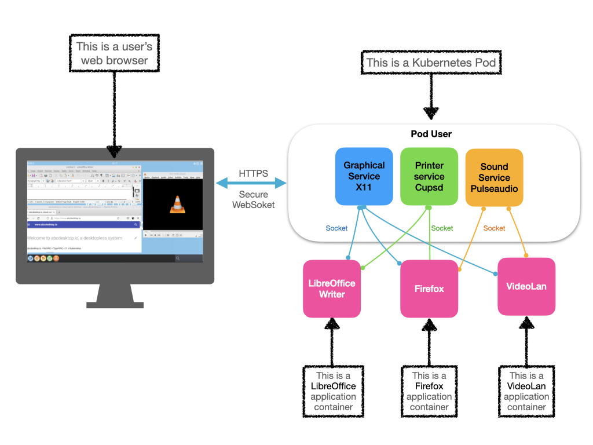

# abcdesktop.io is a desktopless service

[https://www.abcdesktop.io](https://www.abcdesktop.io) is a cloud native desktopless service, and a complete work environment accessible from a simple HTML 5 web browser, without any installation. Like serverless does, desktopless computing allocates desktop applications on demand.  **Each user’s application runs as a container** to reduce attack surface.
abcdeskop.io is an opensource and free solution that offer seamless access to secure desktops and applications on any device, follow the [https://github.com/abcdesktopio](https://github.com/abcdesktopio) links.



## Quick online preview
You can discover abcdesktop.io desktopless services on the demo website. [https://demo.abcdesktop.io](https://demo.abcdesktop.io) instance is a quick example to illustrate how the abcdesktop.io project works. Your desktopless is ready to run for 10 minutes, and will be terminated by the garbage collector after 10 minutes. It requires an OpenID Connect provider to sign-in like (Google, Facebook, Github). The security policy for Internet network prevents requests from your abcdesktop being allowed.
Printer service (using cups) and sound service (using pulseaudio) inside the kubernetes pods are enabled.

* To reach the demo website, follow the link [https://demo.abcdesktop.io](https://demo.abcdesktop.io)
* To read more about abcdesktop.op, follow the link [https://www.abcdesktop.io](https://www.abcdesktop.io)


## abcdesktop.io: a docker VDI service

abcdesktop.io provides a way to run grapicals applications securely isolated in a docker container, and use a web browser HTML5 as display device. Because docker containers are lightweight and run without the extra load of an operating system, you can run many graphical applications on a single kernel or even on a kubernetes cluster.


## Quick installation for kubernetes

Download and extract the latest release automatically (Linux or macOS) or read the step by step installation process [abcdesktop for kubernetes](https://www.abcdesktop.io/3.3/setup/kubernetes_abcdesktop/)

```
curl -sL https://raw.githubusercontent.com/abcdesktopio/conf/main/kubernetes/install-3.3.sh | sh -
```


### abcdesktop.io features 

- Complete native cloud desktop, workspace environment
- Authentification OAuth 2.0, LDAP, LDAPS, Active Directory, Kerberos
- Access to the user home directory (homeDirectory support in Active Directory)
- Legacy CIFS Flexvolume using kubernetes driver 
- All applications run inside an isolated docker container
- Local and remote printing support 
- Off-line sessions are maintained
- No need to install applications any more
- Application update, run latest docker image
- Accounting and reporting (Graylog, Prometheus Grafana)
- Clipboard syncing
- Sound support with [Janus WebRTC Gateway](https://janus.conf.meetecho.com/) and RTP stream

### Applications

- Native support GNU/Linux console native support
- Native support GNU/Linux X11 applications native support
- Support Microsoft Windows applications using wine

## Github repositories 

abcdesktop has 36 repositories available. Follow the code on GitHub [https://github.com/abcdesktopio](https://github.com/abcdesktopio) to get the source code.

# Sponsors

- [Orange](https://www.orange.com) is an official sponsor of abcdesktop.io project
